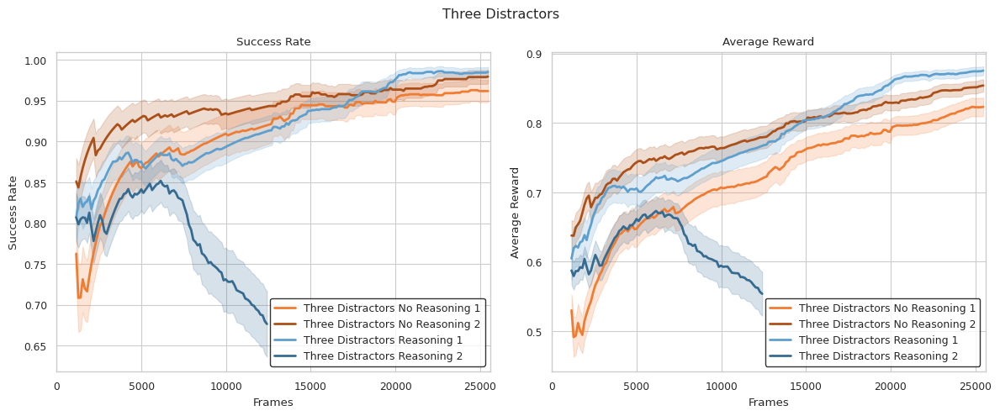

# Incentivizing both Grounding and Reasoning in Large Language Models with Online Reinforcement Learning

[](https://www.python.org/downloads/)
[](https://opensource.org/licenses/MIT)

## Overview

This repository explores the interplay between **reasoning**, **grounding**, and **reinforcement learning** in LLM-based agents. We investigate whether prompting LLM agents to *reason before action selection* improves sample efficiency and generalization during online reinforcement learning in BabyAI-Text environments.

Our approach enables language models to generate actions token-by-token in text-based environments, applying reinforcement learning in a nested fashion to improve performance - a more direct approach than previous methods that compute relative probabilities for each action.

You can find the full report [here](report/acl-ijcnlp2021-templates/acl2021.pdf).

## Key Features

- **Token-by-token Action Generation**: Unlike prior approaches that select from predefined options, our agents generate free-form textual actions
- **Reasoning vs. Direct Action**: Compare agents that verbalize reasoning steps before acting against those that generate actions directly
- **Nested Reinforcement Learning**: A dual-level credit assignment approach that attributes rewards across the decision process
- **BabyAI-Text Integration**: Utilizing text-based navigation environments with varying complexity levels

## Methodology

### Environment: BabyAI-Text

BabyAI-Text is a textual extension of the BabyAI platform designed to study functional grounding of language models in interactive environments. It replaces the original symbolic observations with natural language descriptions, enabling interaction through a text-only interface. The environment includes:

- **Procedurally Generated Grid Worlds**: Navigate through rooms with various objects
- **Language-Based Goals**: Complete missions specified in natural language
- **Sparse Rewards**: Positive reward only upon successful task completion
- **Varying Complexity**: Different quantities of distractor objects (0, 3, or 5)

Example interaction:

```
Task: Pick up the grey box.

Observation:
- You see a wall 3 steps forward.
- You see a wall 1 step right.
- You see a grey box 1 step left and 1 step forward.

Available Actions:
- Turn left
- Turn right
- Go forward
- Pick up
- Drop
- Toggle
```

### Prompt Design and Action Output

We designed two prompting strategies:

1. **Direct Action (No Reasoning)**: The agent outputs only a valid action command without additional commentary

2. **Reasoning**: The agent articulates a brief "thought" process before outputting the action:
   ```
   I should go forward to get slightly closer to the blue key.
   final answer: go forward
   ```

### PPO-Based LLM Fine-tuning

We employ Proximal Policy Optimization (PPO) to fine-tune the LLM's policy, using:

- **LLaMA-3.2-3B-Instruct** as the base model
- **Value head** that estimates state value
- **Low-Rank Adaptation (LoRA)** for parameter-efficient fine-tuning
- **KL-divergence penalty** to keep the policy close to pretrained distributions
- **Nested PPO training** algorithm to handle the dual-level nature of environment interaction and token generation

## Results and Findings

Our experiments revealed that enabling agents to articulate explicit reasoning before generating actions did not significantly improve sample efficiency or generalization across our tested environments.



Key findings:

- **Similar Performance**: Reasoning and non-reasoning agents achieved comparable success rates after PPO fine-tuning
- **Training Instability**: Reasoning agents occasionally showed greater instability during training (see figure above)
- **Reasoning Collapse**: We identified a phenomenon where explanatory text devolved into simply stating the intended action
- **Interpretability Benefits**: Reasoning-based agents offered valuable interpretability without compromising effectiveness

## Installation and Setup

### Prerequisites

- Python 3.8+
- CUDA-compatible GPU (recommended for training)
- Git

### Installation Steps

1. **Clone the repository**
   ```bash
   git clone https://github.com/pavanpreet-gandhi/rl-llm.git
   cd rl-llm
   ```

2. **Create and activate a virtual environment**
   ```bash
   python -m venv .venv
   # On Linux/macOS
   source .venv/bin/activate
   # On Windows
   .\.venv\Scripts\activate
   ```

3. **Install the project in development mode**
   ```bash
   pip install -e .
   ```

4. **Install dependencies**
   ```bash
   pip install -r requirements.txt
   ```

5. **Install BabyAI-Text environment**
   ```bash
   cd Grounding_LLMs_with_online_RL
   pip install blosc
   cd babyai-text/babyai
   pip install -e .
   cd ../gym-minigrid
   pip install -e .
   cd ..
   pip install -e .
   cd ../..
   ```

6. **Setup external services** (optional)
   
   For experiment tracking:
   ```bash
   # Login to Weights & Biases
   wandb login
   
   # Login to Hugging Face
   huggingface-cli login
   ```

### Configuration

Modify the following settings in `train.py` to customize your training run:

- **Experiment Logging**: To disable HuggingFace logging, set `push_to_hub` to `False`
- **Tracking Entity**: Change the `entity` parameter if you want to use your personal W&B account
- **Model Loading**: To continue training from a checkpoint, set:
  ```python
  "pretrained_dir": "your-hf-username/your-model-repo"
  "load_checkpoint": True
  ```

## Running Experiments

1. **Train a model**
   ```bash
   python experiments/train_language_agent.py --config experiments/configs/your_config.json
   ```

2. **Evaluate a trained model**
   ```bash
   python experiments/post-training_tests.py --model-path path/to/your/model
   ```

3. **Visualize agent behavior**
   ```bash
   # Using BabyAI's manual control script
   python Grounding_LLMs_with_online_RL/babyai-text/babyai/scripts/manual_control.py
   ```

## License

This project is licensed under the MIT License - see the [LICENSE.md](LICENSE.md) file for details.

## Acknowledgements

This project builds upon the [Grounding Large Language Models with Online Reinforcement Learning](https://github.com/flowersteam/Grounding_LLMs_with_online_RL) by Carta et al.